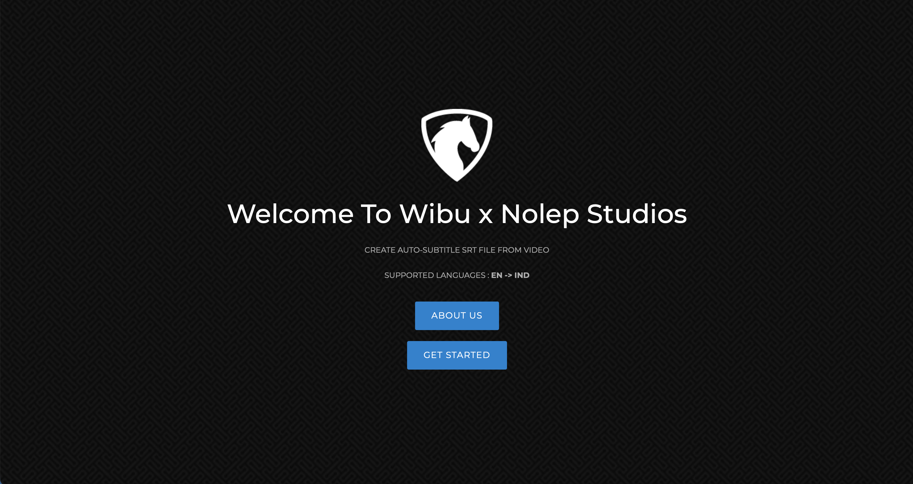
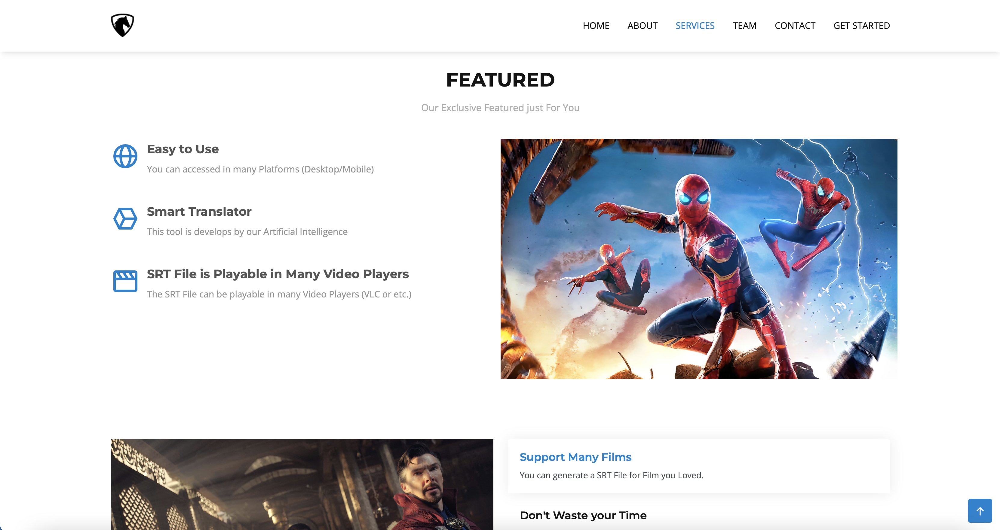
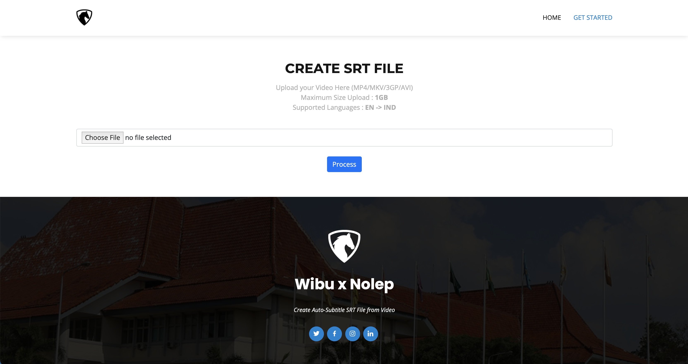

# Utilization of Speech Recognition to Have Indonesian Subtitles and Translations
> Outline a brief description of your project.
> Live demo [_here_](https://auto-subtitle-ofa.herokuapp.com). <!-- If you have the project hosted somewhere, include the link here. -->

## Table of Contents
* [General Info](#general-information)
* [Technologies Used](#technologies-used)
* [Features](#features)
* [Screenshots](#screenshots)
* [Setup](#setup)
* [Usage](#usage)
* [Project Status](#project-status)
* [Room for Improvement](#room-for-improvement)
* [Acknowledgements](#acknowledgements)
* [Contact](#contact)
<!-- * [License](#license) -->


## General Information
We developed an application called Wibu x Nolep as a solution to automatically create subtitles by utilizing Natural Language Processing and also a speech recognition API. The main purpose of this application is to present an automatic way to generate subtitles for audio and video. Replacing the tedious methods of the current system will save time, reduce the amount of administrative work to be done and will generate subtitles automatically with electronic equipment. The system will extract the audio first, then recognize the extracted audio with the available speech recognition APIs. Then the recognized audio is converted into a .wav audio file and then converted back into text and stored in a text file with a “.srt” extension. Later, this “.srt” file can be opened in the media player to view subtitles and videos.
<!-- You don't have to answer all the questions - just the ones relevant to your project. -->


## Technologies Used
- python version 3.10.4
- audiosegment version 0.23.0
- googletrans version 3.1.0a0
- gunicorn version 20.1.0
- Jinja2 version 3.0.3
- itsdangerous version 2.0.1
- Flask version 1.1.1
- pandas version 1.3.4
- pydub version 0.25.13
- SpeechRecognition version 3.8.1
- srt version 3.5.2
- Werkzeug version 2.0.2


## Features
- Easy to Use
- Able to perform voice recognition and translation automatically
- Supported many video file formats

## Lacks
- If the background sound is too loud, for example the sound of an explosion on
  action films will make dialogue not detected properly
- The result of rigid and formal translation
- The length of the process is directly proportional to the length of the video
- Requires an internet connection to run the process
- For now only supports English to Indonesian


## Screenshots



<!-- If you have screenshots you'd like to share, include them here. -->


## Setup
The `requirements.txt` file should list all Python libraries that needed for this project.
This library will be installed using:

```
pip install -r requirements.txt
```

## Usage
- Clone this Repository
Type on your CMD or Terminal :

`git clone https://github.com/daffaarizkyy/auto-subtitle-ofa.git`

- cd to your directory (on where's you clone this project)
Type on your CMD or Terminal (example) :
`cd auto-subtitle-ofa`

- Run `pip install -r requirements.txt`

- And Run `python app.py`

- Open your browser and enter `localhost:5000` or `http://127.0.0.1:5000/`


## Project Status
Project is: _complete_


## Room for Improvement
Include areas you believe need improvement / could be improved. Also add TODOs for future development.

Room for improvement:
- The translation needs to be improved so that it is not stiff and formal
- Improvement to be done 2

To do:
- Added more supported languages
- Features allow users to edit srt file after automatic translations


## Acknowledgements
- This project was inspired by Youtube Closed Captions and Many Films with Subtitle.

Many thanks to:
- Angga Dwi Andriansyah : Deployment back-end
  Universitas Sriwijaya, Majoring in Informatics Engineering

- Irvan Kurniawan : Modelling
  Universitas Sriwijaya, Majoring in Informatics Engineering

- Muhammad Azka Hisbullah : Modelling
  Universitas Sriwijaya, Majoring in Informatics Engineering

- Muhammad Daffa Rizky Fatarah : UI/UX dan front-end
  Universitas Sriwijaya, Majoring in Informatics Engineering


## Contact
Created by [@Wibu x Nolep](https://www.unsri.ac.id/) - feel free to contact us!


<!-- Optional -->
<!-- ## License -->
<!-- This project is open source and available under the [... License](). -->

<!-- You don't have to include all sections - just the one's relevant to your project -->